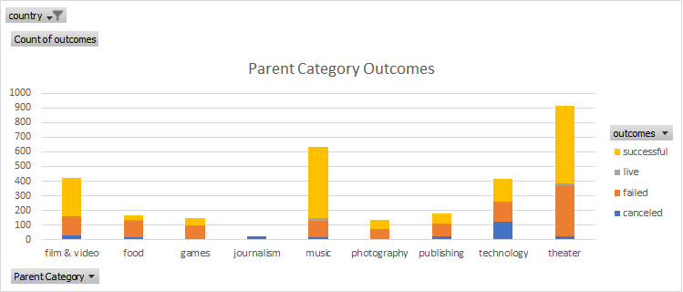

# Kickstarting with Excel
## Overview of Project
An Analysis of Kickstarter Campaigns, their categories, and their goals.
### Purpose 
In this project, we'll see the similarities and differences between different categories of kickstarter's, their countries, and their rate of success or failure--all for Louise to have the best opportunity at funding her play, "Fever".
## Analysis and Challenges
Overall, we can see in our data and visualizations that Louise has good odds of running a successful Kickstarter campaign--this comes from her budget and her chosen category of "Theater". Her budget is significantly above the average successful goal for theater Kickstarter campaigns, but if she times the launch of her campaign correctly, she will have an over 50% chance of being successful with meeting her goal. There were over 4000 lines of data in the original dataset. A challenge included in this analysis was understanding the fundamental meaning of the data points. Once we converted our start and end dates to a MM/DD/YYYY format and separated our parent categories and subcategories, we were able to more simply understand what this data set was trying to tell us.

### Analysis of Outcomes Based on Launch Date
We can see in our pivot table and pivot chart, that the vast majority of Theater campaigns finished successfully. The launch date that produced the most successful campigns is May (perhaps people want to give away their tax returns in the US). May has the highest percentage opportunity to have a successful campaign (at 66.8%). But December has the highest opportunity for a failed campaign (at 46.6%). I would recommend Louise start her campaign in May.

### Analysis of Outcomes Based on Goals
The most successful goal amount, to no surprise, is goals at less than $1000 (76% of these campaigns were successful). When looking at our visualization, we can see there are two dips of successful campaigns ($25,000-$29,999 & $45,000-$49,999) at 20% and 0%, respectively. There is a large spike in successful campaigns at the $35,000-$39,999 goal with a 67% success rate. However, there are more than 10-times as many campaigns in Louise's goal range, making her 54% success rate more significant. Overall, Louise's goal is higher than the successful average (avg. $5,049), and even higher than the failed average ($10,554), but there are still steps she can take to best set her up for sucess.

### Challenges and Difficulties Encountered
As stated above, the challenges that were encountered in this project included the size of the dataset, understanding the fundamental meaning of the data points, and converting the necessary fields to readable number formats. 
## Results
We can conclude that Louise has more than a 50% chance of meeting her desired goal if she launches her campaign in May. Her success rate may be jeopardized if she launches in December - the month with the lowest sucess rate. For outcomes based on goals - the goal with the highest success rate is less than $1,000. However, Louise's goal has a 50% success rate, surely making it possible for Louise to score her funding. This dataset is limited in size. If it were larger, with more points, we would have the opportunity to gain an even fuller picture of what Kickstarter campaigns can look like. Additionally, we are not seeing any details of these campaigns (descirptions, photos, etc.) that appeal to patrons and those individuals looking to donate. We could create tables and graphs with the Country of the campaign listed as the x-axis instead of as a filter. We then would be able to see a comparative view of campaigns baesed on country.
